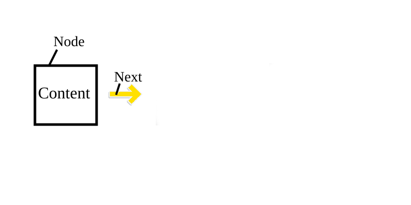

# bonus_libft
Okay, I finally convinced myself to do libft bonus as it helps me on my next projects to learn what are lists so come with me on this adventure.
Quick disclaimer I've decided to not even touch github of anyone else to make this project. So, theres a chance not everything will be the same as other people.

## GETTING STARTED WITH THE WORK!
### Personal step:
Okay, since I never worked with lsts before I set a markdown map using the VSCode extension
```
# Objective

## Learn about lists

### Whats a list?
### What is it used for?

## How to use?

### lst Header
### lst Makefile

## Functions

### ft_lstnew
### ft_lstadd_front
### ft_lstsize
### ft_lstlast
### ft_lstadd_back
### ft_lstdelone
### ft_lstclear
### ft_lstiter
### ft_lstmap
```
This extension is supper easy to use and really helps.

### Personal Step 2:
Learn about lists...
#### So what's a list?
Lists in C are a collection of elements of the same data type, stored in a sequential order. It is implemented as a linked list data structure, where each element (node) contains a value and a pointer to the next element in the list. Lists are commonly used to store and manipulate data in a dynamic and efficient way.

#### What is it used for?
Lists are commonly used to store and manipulate collections of data in a efficient way.  Ther are particulary useful when the size of the collection is not known in advance, or when the collection needs to be modified frequently. Lsts can be used to implement various data structures such as stacks, queues, and hash tables, and are also used in algorithms such as sorting and searching.

## Starting the project...

### Integrate your project in your header file

Acording to intra we have this info...

You have to use the following structure to represent a node(the elements) of your list. Add its
declaration to your libft.h file:
```
typedef struct s_list
{
void *content;
struct s_list *next;
} t_list;
```
This file is our define of a list so imagine usually u make `int	n;` in this case if u make a `t_list	n;` ur making a list that has a content and a next inside.
And how do you make a list? ft_lstnew down bellow in a little.

We use the subject to get our prototips of the functions and add them to our header file.
```
t_list	*ft_lstnew(void *content);
void	ft_lstadd_front(t_list **lst, t_list *new);
int		ft_lstsize(t_list *lst);
t_list	*ft_lstlast(t_list	*lst);
void	ft_lstadd_back(t_list **lst, t_list *new);
void	ft_lstdelone(t_list *lst, void(*del)(void *));
void	ft_lstclear(t_list **lst, void(*del)(void *));
void	ft_lstiter(t_list *lst, void(*f)(void *));
t_list	*ft_lstmap(t_list *lst, void *(*f)(void *), void(*del)(void *));
```

### Integrate your project on the makefile

First we add our new bonus functions under the SRC functions like so:
```
bonus = ft_lstnew ft_lstadd_front ft_lstsize ft_lstlast ft_lstadd_back\
ft_lstdelone ft_lstclear ft_lstiter ft_lstmap\
```
Then we fix our `clean:`.
```
clean:
  $(RM)  $(SRC:=.o) $(bonus:=.o)
```
Then we add a new line by the end of our `re:` and we write our `bonus:`.
```
re:	fclean	$(NAME)
bonus:	$(SRC:=.o)	$(bonus:=.o)
		ar rc $(NAME) $(SRC:=.o)	$(bonus:=.o)
```
Now our header and makefile are complete. Starts the functions. Let's do our best to lean together...

## Functions...
### ft_lstnew

The first step is to add our library and our prototip of the function:
```
#include "libft.h"

t_list	*ft_lstnew(void *content) //why void *content? because it can be any type of data
```
Now we create a new variable using the t_list we previously created.
Now we create a new lest *n we give that list sizeof t_list to make sure that the *n list has enough space for the contents of the t_list and the next.
We protect the malloc.

We name our new list N and give it enough space for a t_list.

We give n the content of content. And since we don't have anything to link we make a `n->next = NULL`.
```
{
	t_list	*n;

	n = (t_list *)malloc(sizeof(t_list));
	if (n == NULL)
		return (NULL);
	n->content = content;
	n->next = NULL;
	return (n);
}
```

# Best Lists Explanation...
(quick intremission for the best explanation)

Our list has 
a type defenition,
a content that can be any value and a next.

(also a name but whatever...)
```
typedef struct	s_list //start of the struct
{
	void			*content; //content of the list
	struct s_list	*next; //what it points to
}	t_list; //Name
```
Now we assume this:

The box and its content and the next is a node or our list. Here we give content and the next points to `NULL` so the arrow points nowhere
Content = Inside the box
Next = What the list points to
Node = The box

### ft_lstadd_front
The first step is to add our library and our prototip of the function:
```
#include "libft.h"

void	ft_lstadd_front(t_list **lst, t_list *new)
{
//code
}
```
How do we do this? Simple add if that checks if *lst is != then 0 and if it is you five the value of new->next = *lst.
then we turn lst into new.
```
	if (*lst)
		new->next = *lst;
	*lst = new;
```
